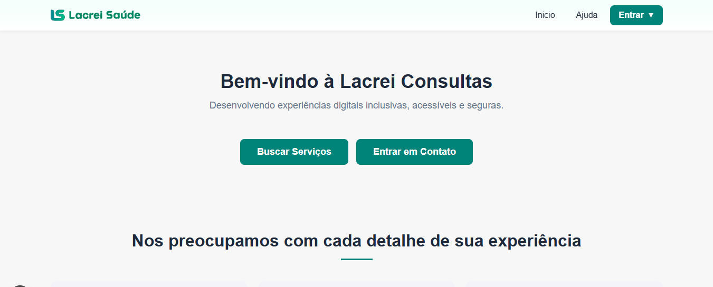
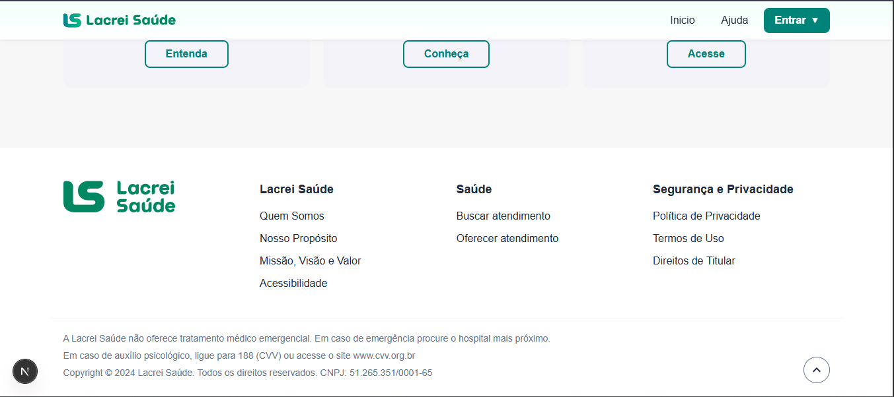

# Lacrei Saúde: Acessibilidade

[](https://nextjs.org/)
[](https://www.typescriptlang.org/)
[](https://styled-components.com/)

Este projeto é um desafio da Lacrei Saúde, focada em aprimorar a **Experiência do Usuário (UX)**, garantir a **Acessibilidade (A11y)**.

---

## 🎯 Objetivo do Projeto

O objetivo principal foi utilizando as melhores práticas do React/Next.js e TypeScript para transformar em um código funcional, acessível e responsivo.

### Principais Entregas:
* **Implementação do Layout:** Criação do Header e Footer, além da seção de Cards de Valor.
* **Tipagem Forte:** Uso de **TypeScript** para garantir a robustez e evitar erros de *runtime*.
* **Design System Simplificado:** Utilização do Styled Components para criar um sistema de cores (`theme.ts`) e garantir a coesão visual.
* **Interatividade:** Inclusão dos dois elementos interativos e atenção à semântica HTML.
* **Acessibilidade (A11y):** Foco na semântica das tags e uso de atributos **ARIA**.

---

## 🔗 Link do Deploy Público

**URL:** https://lacrei-consultas-cecbu6vam-allissoncostas-projects.vercel.app/

---
## ✨ Resultado Visual

Abaixo, dois *screenshot* da página inicial após a finalização.
---

!
---

!
 

---

## 🛠️ Stack Tecnológica

* **Framework:** [Next.js](https://nextjs.org/)
* **Linguagem:** [TypeScript](https://www.typescriptlang.org/)
* **Estilização:** [Styled Components](https://styled-components.com/)

---

## 💻 Estrutura do Código & Justificativas Técnicas

### 1. Sistema de Temas

A abordagem de **Styled Components Theming** foi usada para criar um único ponto de verdade para cores, tipografia e *breakpoints*.

* **Benefício:** Permite a rápida substituição da paleta de cores e facilita a aplicação de temas.

### 2. Componentes e Semântica

* **Header & Footer:** Componentes foram divididos em subcomponentes (e.g., `NavLinks`, `SocialIcons`) para melhor manutenibilidade e clareza do código.
* **Acessibilidade (A11y):**
    * **Botões de Ação:** Receberam *handlers* **`onClick`** para demonstrar interatividade e usam atributos **`aria-label`** para navegação assistida.
    * **Navegação:** O Header utiliza tags semânticas (`<nav>`) e links.
* **Seção de Cards (`ValueCardsSection`):** Foi estruturada usando `grid` para responsividade.


### 3. Responsividade e Layout

* **Design Mobile-First:** A estilização foi construída com *breakpoints* (`mobile`, `tablet`, `desktop`) definidos no `theme.ts`, garantindo que o layout seja adaptável a diferentes tamanhos de tela.

---
## ⚙️ Estrutura do Projeto
```
lacrei-consultas/
├── .next/                 
├── node_modules/           
├── public/                 
│   └── images/
├── pages/              
│   ├── _app.tsx        
│   ├── index.tsx       
│   └── servicos.tsx               
├── src/                    
│   ├── components/
│   │   ├── layout/         
│   │   │   ├── Footer/
│   │   │   │   ├── index.tsx
|   |   |   |   ├── styles.ts
|   |   |   |   ├── __tests__/
|   |   |   |   |   └──  Footer.test.tsx
│   │   │   ├── Header/
│   │   │   │   ├── __tests__/
│   │   │   │   │   └── Header.test.tsx
│   │   │   │   ├── index.tsx
│   │   │   │   └── styles.ts
│   │   │   └── Layout/     
│   │   │       └── index.tsx
│   │   └── ui/            
│   │       ├── Button/
│   │       │   ├── __tests__/
│   │       │   │   └── Button.test.tsx
│   │       │   ├── index.tsx
│   │       │   └── styles.ts
│   │       └── ButtonExample/ 
│   │           └── index.tsx 
│   ├── styles/             
│   │   ├── theme.ts        
│   │   ├── GlobalStyles.ts 
│   │   └── styled.d.ts     
│   └── types/              
│       └── styled-components-jest.d.ts 
├── .babelrc                
└── .gitignore
├── .eslintrc.json          
├── jest.config.js          
├── jest.setup.ts            
└── next-env.d.ts
├── next.config.js         
└── package-lock.json
├── package.json
└── postcss.config.mjs
└── README.md
└── tsconfig.json
```
---

## 🚀 Como Executar o Projeto

Certifique-se de ter o Node.js instalado.

1.  **Clone o repositório:**
    ```bash
    git clone https://github.com/AllissonCosta/lacrei-consultas
    cd lacrei-saude-refatoracao
    ```

2.  **Instale as dependências:**
    ```bash
    npm install
    # ou
    yarn install
    ```

3.  **Inicie o servidor de desenvolvimento:**
    ```bash
    npm run dev
    # ou
    yarn dev
    ```

O projeto estará acessível em `http://localhost:3000`.